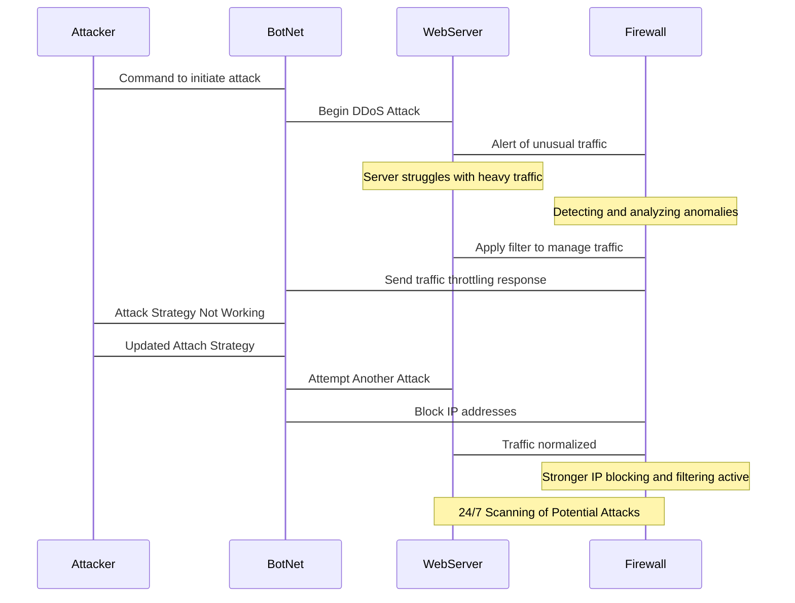

```mermaid
sequenceDiagram
participant Attacker
participant BotNet
participant WebServer
participant Firewall

Attacker -> BotNet: Command to initiate attack
BotNet -> WebServer: Begin DDoS Attack
WebServer -> Firewall: Alert of unusual traffic

Note over WebServer: Server struggles with heavy traffic
Note over Firewall: Detecting and analyzing anomalies

Firewall -> WebServer: Apply filter to manage traffic 
Firewall -> BotNet: Send traffic throttling response

BotNet -> Attacker: Attack Strategy Not Working
Attacker -> BotNet: Updated Attach Strategy
BotNet -> WebServer: Attempt Another Attack

Firewall -> BotNet: Block IP addresses
Firewall -> WebServer: Traffic normalized

Note over Firewall: Stronger IP blocking and filtering active
Note over Firewall, WebServer: 24/7 Scanning of Potential Attacks
```
