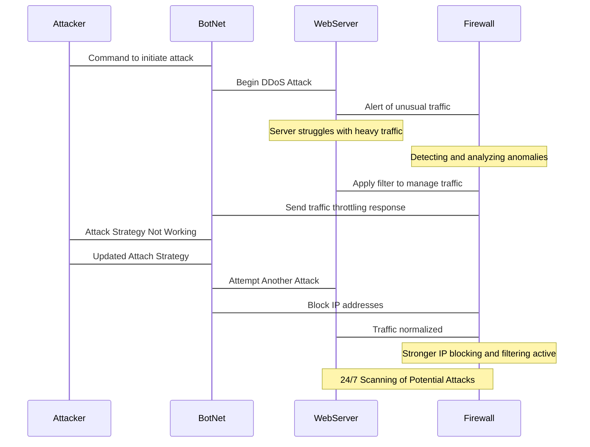

# _**DDoS Attack Sequence Explained**_

### **Attacker Tells BotNet to Start the Attack**
- The Attacker kicks things off by sending instructions to their BotNet—a network of hijacked devices—telling it to launch a DDoS attack on the WebServer.

### **BotNet Bombards the WebServer with Traffic**
- The BotNet follows the order and floods the WebServer with an overwhelming amount of fake traffic, trying to take it offline.

### **WebServer Alerts Firewall About the Strange Traffic**
- The WebServer quickly notices something’s not right. It struggles to handle all the traffic and sends a heads-up to the Firewall to investigate.
  
### **Server is Struggling Under the Load**
- The WebServer is on the verge of crashing, trying to deal with the flood of incoming requests. This is where the attack starts to hurt.
  
### **Firewall Starts Analyzing the Situation**
- The Firewall steps in and begins analyzing the traffic, looking for patterns to figure out what’s real and what’s part of the attack.
  
### **Firewall Filters Traffic to Help the Server**
- The Firewall creates rules to filter the traffic, letting legitimate users through while blocking suspicious activity. This takes some of the pressure off the WebServer.
  
### **Firewall Pushes Back Against the BotNet**
- To slow things down even more, the Firewall sends a response to the BotNet, throttling its traffic and reducing its ability to overwhelm the system.
  
### **BotNet Reports Back to the Attacker**
- The BotNet lets the Attacker know their plan isn’t working because the Firewall is blocking their efforts.
  
### **Attacker Adjusts Their Strategy**
- Not giving up, the Attacker comes up with a new attack plan and sends updated instructions to the BotNet.

### **BotNet Launches Another Wave of Attacks**
- The BotNet tries again, using the new strategy in an attempt to outsmart the Firewall.
  
### **Firewall Blocks the BotNet’s IPs**
- The Firewall identifies the IP addresses being used by the BotNet and blocks them completely, cutting off its access to the WebServer.

### **Traffic Returns to Normal**
- With the malicious traffic stopped, the Firewall restores normal operations, and the WebServer can serve its legitimate users again.

### **Firewall Tightens Security Further**
- The Firewall strengthens its defenses, making it harder for similar attacks to succeed in the future.

### **Ongoing Monitoring for Future Threats**
- Both the Firewall and WebServer stay on high alert, scanning traffic 24/7 to detect and prevent any potential attacks down the road.
